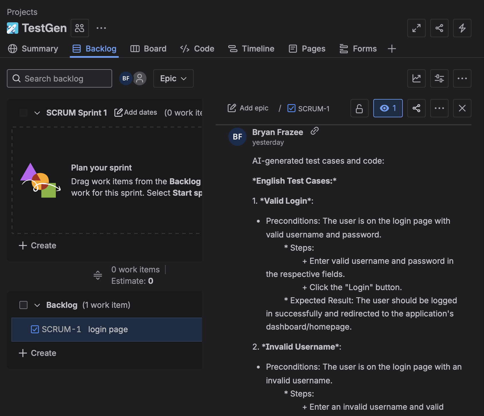

# 🚀 Release Notes – AI Bot for Test Case Generation (v0.1.0)

## 📖 Overview  
This release introduces the **AI-powered Test Case Generation Bot**, a Python-based automation assistant that integrates **Jira** with **local LLMs (via Ollama)** to automatically generate, manage, and track test cases and test code from user stories.  

---

## ✨ New Features
- **Jira Integration**
  - Secure authentication with Jira Cloud using API tokens.
  - Automatically fetches user stories (summary + description).
  - Posts AI-generated test cases and code directly as Jira comments for full traceability.
  - See below screenshots

- **LLM-Powered Test Case Generation**
  - Connects to **local LLMs (Ollama with Llama 3.1 or CodeLlama)** for cost-effective and private code generation.
  - Generates:
    - Plain-English test cases.
    - Java RestAssured + JUnit API test classes.
    - *(Planned)* Python Playwright UI test cases.

- **Test Code Management**
  - Generates structured code artifacts.
  - *(Planned)* Automatically commits generated test code into GitHub/GitLab repositories with repo references linked back in Jira.

- **Feedback & Traceability**
  - Adds AI-generated test cases and code back to Jira issues.
  - Establishes traceability between Jira stories, generated tests, and future CI/CD executions.

- **Execution Pipeline (Planned)**
  - Integrate with CI/CD systems (GitHub Actions, Jenkins, GitLab CI).
  - Automatically run generated tests post-commit.
  - Push execution results (pass/fail) back into Jira.

---

### 🏗️ High-Level Architecture

**1. Jira Integration Layer**  
- Python (`jira` library or REST API)  
- Fetches user stories and posts AI-generated test cases back to Jira  

**2. LLM Integration Layer**  
- Ollama (local) or OpenAI/Anthropic (cloud, optional)  
- Generates test case descriptions and code  

**3. Test Code Generation & Management**  
- Java (RestAssured + JUnit) for API tests  
- Python (Playwright) for UI tests  

**4. Repository Integration (Planned)**  
- GitHub or GitLab API  
- Automatically commit generated test code and link back to Jira  

**5. CI/CD Feedback (Planned)**  
- Jenkins, GitHub Actions, or GitLab CI  
- Run generated tests and report results back to Jira

---

## 🔄 Workflow and Usage
- **Prereqs**
  - Setup a Jira account (if not already done).
  - Setup and have Ollama running locally:
    - `brew install ollama`  
    - or [download from Ollama](https://ollama.com/download)
  - Create a Jira Token

  
1. User creates a story in Jira.
2. git clone https://github.com/YOUR-USERNAME/jira-ai-testgen.git
   cd jira-ai-testgen 
3. pip install -r requirements.txt
4. pip install -e .
5. python3 jiratestgen.py SCRUM-1 ....<issue/story # ie.. SCRUM-1> (takes about 1 minute)
6. LLM generates test cases + code.  
7. Output is stored in repos and linked back to the Jira story in the comments section.
8. *(Future)* CI/CD runs generated tests and reports back to Jira.  

---

## 🛠️ Tech Stack
- **Driver**: Python  
- **Jira Integration**: [`jira`](https://pypi.org/project/jira/) Python library, Jira REST API  
- **LLM**: [Ollama](https://ollama.ai/) (Llama 3.1, CodeLlama, DeepSeek-Coder)  
- **API Tests**: Java (JUnit + RestAssured)  
- **UI Tests**: Python (Playwright) *(planned)*  
- **Repo Integration**: GitHub/GitLab API *(planned)*  
- **CI/CD Feedback**: GitHub Actions / Jenkins / GitLab CI *(planned)*  

---

## 🐞 Known Issues
- Ollama server may require manual restart if port `11434` is locked.  
- API test code generation only; UI test generation is not yet implemented.  
- Repository commit automation is not yet enabled.  

---

## 📌 Next Steps
- Add **UI test case generation** (Python + Playwright).  
- Implement **repo integration** (auto-commit tests to GitHub).  
- Enable **CI/CD pipeline feedback loop** to push test results into Jira.  
- Support **multiple LLM backends** (OpenAI, Anthropic, local models).  

---

⚡ This release sets the foundation for **end-to-end intelligent test automation**:  
User stories → AI-generated tests → repository commits → CI/CD execution → Jira traceability.

